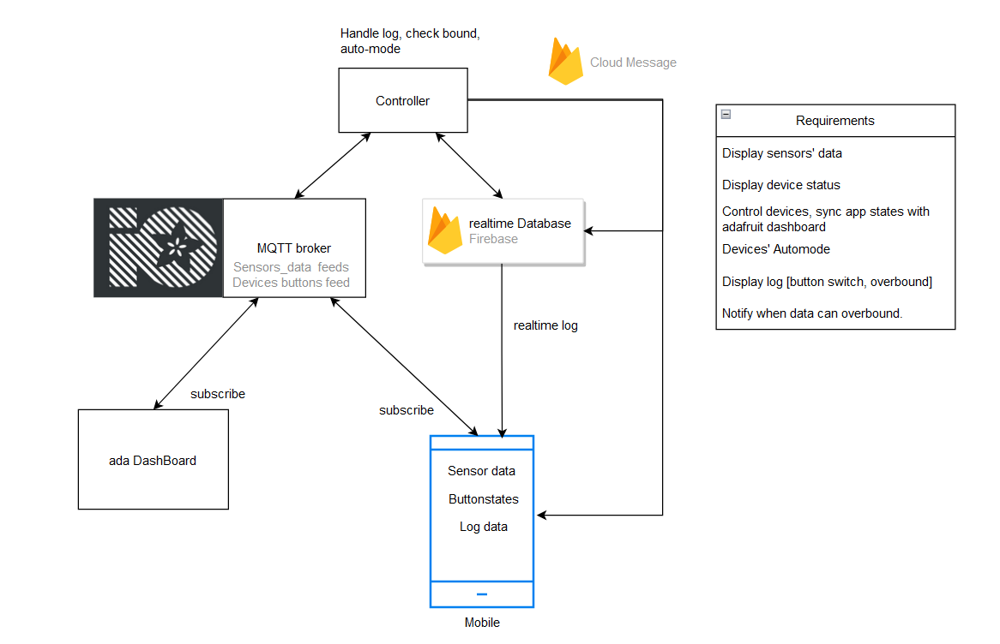

# SMART FARMING
Smart Farming application with the integration of IOT sensors.

> Overall system

## Project Structure
* [Mobile Application](/mobile/)
* [Server-side Script](/server/) 

## Features
* Display Plant evironment status in realtime including: `light` `temperature` `humidity`.
* Enable user to controll over devices: `Fan` `Water pump` `Light Bulb`.
* Automatically controll over devices when `auto-mode` is `ON`.
* Display log for user's activities, environment data overbound.
* Indicate user when environment data `will overbound`.

## Installation
Follow the installation guidance for Mobile and server-side.
* [Server-side Installation guidance](/server/README.md#installation)
* [Mobile Installation guidance](/mobile/README.md#installation)

## Contribution
This project is a School excercise and developed by our group's member. Therefore, we are not actively seek for other contributors. However, feel free to share any suggestions or idea that you have and believe it could improve our project by submiting a issue or pull request.